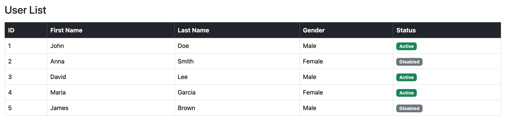

# Homework 

```html
<!DOCTYPE html>
<html lang="en">

<head>
    <meta charset="UTF-8">
    <title>User Table</title>
    <link href="https://cdn.jsdelivr.net/npm/bootstrap@5.3.2/dist/css/bootstrap.min.css" rel="stylesheet">
</head>

<body>
    <div class="container mt-5">
        <h3 class="mb-3">User List</h3>

        <table class="table table-bordered table-hover align-middle">
            <thead class="table-dark">
                <tr>
                    <th>ID</th>
                    <th>First Name</th>
                    <th>Last Name</th>
                    <th>Gender</th>
                    <th>Status</th>
                </tr>
            </thead>
            <tbody id="userTable">
                <!-- Data will be inserted here -->
                <!-- <tr>
          <td>1</td>
          <td>Mey</td>
          <td>Mora</td>
          <td>Female</td>
          <td>
            <span class="badge bg-success">
              Active
            </span>
          </td>
        </tr>
        <tr>
          <td>2</td>
          <td>Sok</td>
          <td>San</td>
          <td>Male</td>
          <td>
            <span class="badge bg-secondary">
              Disabled
            </span>
          </td>
        </tr> -->
            </tbody>
        </table>
    </div>
</body>
<script src="script.js"></script>

</html>
```

# Classwork 1

```html
<!DOCTYPE html>
<html lang="en">

<head>
    <meta charset="UTF-8">
    <title>Student Registration</title>
    <link href="https://cdn.jsdelivr.net/npm/bootstrap@5.3.2/dist/css/bootstrap.min.css" rel="stylesheet">
</head>

<body>

    <div class="container mt-5">

        <!-- FORM CARD -->
        <div class="row justify-content-center" id="formCard">
            <div class="col-md-8">
                <div class="card shadow">
                    <div class="card-header bg-primary text-white text-center">
                        <h4>Student Registration</h4>
                    </div>

                    <div class="card-body">
                        <form id="studentForm">

                            <!-- English Name -->
                            <div class="mb-3">
                                <label class="form-label">English Name</label>
                                <input type="text" id="enName" class="form-control">
                                <small class="text-danger" id="enNameError"></small>
                            </div>

                            <!-- Khmer Name -->
                            <div class="mb-3">
                                <label class="form-label">Khmer Name</label>
                                <input type="text" id="khName" class="form-control">
                                <small class="text-danger" id="khNameError"></small>
                            </div>

                            <!-- Gender -->
                            <div class="mb-3">
                                <label class="form-label">Gender</label><br>
                                <input type="radio" name="gender" value="Male"> Male
                                <input type="radio" name="gender" value="Female"> Female <br>
                                <small class="text-danger" id="genderError"></small>
                            </div>

                            <!-- Email -->
                            <div class="mb-3">
                                <label class="form-label">Email</label>
                                <input type="email" id="email" class="form-control">
                                <small class="text-danger" id="emailError"></small>
                            </div>

                            <!-- Phone -->
                            <div class="mb-3">
                                <label class="form-label">Phone</label>
                                <input type="text" id="phone" class="form-control">
                                <small class="text-danger" id="phoneError"></small>
                            </div>

                            <!-- Subjects -->
                            <div class="mb-3">
                                <label class="form-label">Subjects</label><br>
                                <input type="checkbox" class="subject" value="JavaScript"> JavaScript <br>
                                <input type="checkbox" class="subject" value="PHP"> PHP <br>
                                <input type="checkbox" class="subject" value="Java"> Java <br>
                                <input type="checkbox" class="subject" value="C#"> C# <br>
                                <small class="text-danger" id="subjectError"></small>
                            </div>

                            <div class="text-center">
                                <button type="submit" class="btn btn-success" onclick="addStudent()">Submit</button>
                                <button type="submit" class="btn btn-primary" onclick="resetForm()">Reset</button>
                            </div>

                        </form>
                    </div>
                </div>
            </div>
        </div>

        <!-- RESULT CARD -->
        <div class="row justify-content-center d-none" id="resultCard">
            <div class="col-md-8">
                <div class="card shadow">
                    <div class="card-header bg-success text-white text-center">
                        <h4>Student Information</h4>
                    </div>
                    <div class="card-body" id="result">

                    </div>
                </div>
            </div>
        </div>

    </div>

    <script src="classwork1.js">

    </script>

</body>

</html>
```
